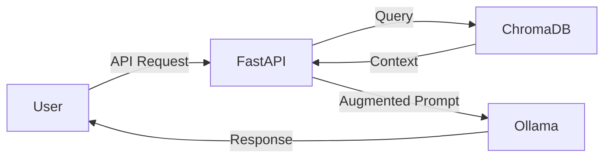

# 🧠 Cerebro RAG Microservice
> **A Cloud-Native, Retrieval-Augmented Generation (RAG) Microservice for private, scalable document intelligence.**


Cerebro is a production-ready **RAG Microservice** designed to transform static documents into an interactive knowledge base. Built with a focus on **DevOps best practices**, it features automated CI/CD pipelines, containerized orchestration, and local LLM inference.

---

## 🛠️ Tech Stack

| Component | Technology | Description |
| :--- | :--- | :--- |
| **API Framework** | FastAPI | High-performance, asynchronous Python framework. |
| **Brain** | Ollama (TinyLlama) | Local LLM inference for privacy and speed. |
| **Memory** | ChromaDB | Vector database for semantic document retrieval. |
| **Containerization** | Docker | Packaging the environment into immutable units. |
| **Orchestration** | Kubernetes (Minikube) | Managing scaling and service networking. |
| **CI/CD** | GitHub Actions | Automated testing and quality gatekeeping. |

---

## ✨ Key Features

* **⚡ Real-time Injection:** Add text data to the knowledge base via the `/add` endpoint.
* **🔍 Semantic Search:** Uses vector embeddings to find context, even if keywords don't match.
* **🛡️ Private AI:** Runs entirely locally via Ollama—no data leaves your infrastructure.
* **🧪 Deterministic Testing:** Includes a "Mock LLM" mode for CI/CD to verify retrieval logic without compute overhead.
* **📟 Hacker UI:** A custom-built, terminal-themed frontend for interacting with the core.

---


## ⚡ Quick Start (Run with Docker)

Don't want to clone the repo? You can pull the pre-built image directly from Docker Hub and run it instantly:

```bash
# Pull the latest image
docker pull johnspalatty/rag-app

# Run the container
docker run -p 8000:8000 johnspalatty/rag-app

```

---

## 🚀 Getting Started

### 1. Prerequisites
* Python 3.10+
* Docker Desktop
* Ollama (running `tinyllama`)

### 2. Installation
```bash
# Clone the repo
git clone [https://github.com/your-username/cerebro-rag.git](https://github.com/your-username/cerebro-rag.git)

# Install dependencies
pip install -r requirements.txt

# Run the service
uvicorn main:app --reload
3. Containerization

```

### 3. Containerization

```bash
# Build the image
docker build -t cerebro-rag .

# Run via Docker
docker run -p 8000:8000 cerebro-rag

```

---

## 🏗️ Architecture

Cerebro is built as a **loosely coupled microservice**. It exposes a RESTful API that can be consumed by any frontend, while maintaining its own persistent storage and AI runtime.



---

## 🧪 DevOps & Quality

This project implements a full **CI/CD pipeline** via GitHub Actions:

* **Linting:** Ensures code PEP8 compliance.
* **Semantic Testing:** Validates that the RAG system retrieves the correct documents.
* **Mock Mode:** Allows for ultra-fast testing of the pipeline without needing a GPU.

---

## 👤 Author

**John S Palatty**
*Final Year Engineering Student & Backend Enthusiast*
