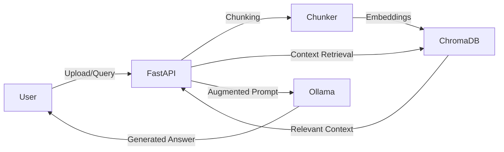

# 🧠 Cerebro RAG Microservice
> **A Cloud-Native, Retrieval-Augmented Generation (RAG) Microservice for private, scalable document intelligence.**


Cerebro is a production-ready RAG Microservice designed to transform static documents into an interactive knowledge base by combining high-performance retrieval with local generative AI. Built with a focus on DevOps best practices, it features automated containerized orchestration and local LLM inference via Ollama to ensure data privacy and system scalability. The architecture is highly adaptable, allowing you to switch between different AI models (such as qwen2.5, tinyllama, or llama3) simply by updating the LLM_MODEL variable within the Docker Compose file.

---

## 🛠️ Tech Stack

| Component | Technology | Description |
| :--- | :--- | :--- |
| **API Framework** | FastAPI | High-performance, asynchronous Python framework. |
| **Brain** | Ollama (TinyLlama) | Local LLM inference for privacy and speed. |
| **Memory** | ChromaDB | Vector database for semantic document retrieval. |
| **Parsing**  | PyPDF | Automated text extraction from PDF and Markdown files. |
| **Containerization** | Docker | Packaging the environment into immutable units. |
| **Orchestration** | Kubernetes (Minikube) | Managing scaling and service networking. |
| **CI/CD** | GitHub Actions | Automated testing and quality gatekeeping. |

---

## ✨ Key Features

* **⚡ Real-time Injection:** Add text data to the knowledge base via the `/add` endpoint.
* **📁 Multi-Format Ingestion:** Supports .pdf, .txt, and .md file uploads with automated chunking.
* **🔍 Semantic Search:** Uses vector embeddings to find context, even if keywords don't match.
* **🛡️ Private AI:** Runs entirely locally via Ollama—no data leaves your infrastructure.
* **🧪 Deterministic Testing:** Includes a "Mock LLM" mode for CI/CD to verify retrieval logic without compute overhead.
* **📊 Intelligence Metrics:** Provides a Confidence Score (%) and status (High/Medium/Low) for every answer.
* **💻 Modern UI:** A clean, professional web dashboard for document management and real-time inference.

---


## 🛠️ API Endpoints

| Method | Endpoint | Description |
| :--- | :--- | :--- |
| **POST** | /query?q=... | Ask a question based on stored knowledge. |
| **POST** | /upload | Upload a PDF/TXT file for indexing. |
| **POST** | /add?text=... | Inject a quick string of text into memory. |
| **GET**  | /list | View all indexed documents and their segments. |
| **DELETE** | /delete/{id} | Purge specific document sectors from the core. |

---


## ⚡ Quick Start (Docker Compose)

The fastest way to deploy the full stack (API + Ollama + Model Puller) is using Docker Compose:

```bash

# Start the entire infrastructure
docker-compose up -d

# UI
http://localhost:8000/

#FAST API
http://localhost:8000/docs

```

---

## 🚀 Manual Setup

### 1. Prerequisites
* Python 3.10+
* Docker Desktop
* Ollama (running qwen2.5:3b or tinyllama)

### 2. Installation
```bash
# Clone the repo
git clone https://github.com/JohnSunny511/cerebro-rag.git

# Install dependencies
pip install -r requirements.txt

# Run the service
uvicorn app:app --reload


```

---

## 🏗️ Architecture

Cerebro is built as a **loosely coupled microservice**. It exposes a RESTful API that can be consumed by any frontend, while maintaining its own persistent storage and AI runtime.


```mermaid
graph LR
    User -->|Upload/Query| FastAPI
    FastAPI -->|Chunking| Chunker
    Chunker -->|Embeddings| ChromaDB
    FastAPI -->|Context Retrieval| ChromaDB
    ChromaDB -->|Relevant Context| FastAPI
    FastAPI -->|Augmented Prompt| Ollama
    Ollama -->|Generated Answer| User

```

---

## 🧪 DevOps & Quality

Cerebro is built with a "Reliability-First" mindset, ensuring the RAG pipeline is both predictable and easy to maintain:
* **Pydantic Data Integrity:** Every request and response is strictly validated via Pydantic schemas, preventing "silent failures" and ensuring the API remains robust under heavy load.
* **Smart Orchestration:** The model-puller service handles the heavy lifting of environment provisioning, ensuring the LLM is ready before the API accepts its first connection.
* **Lightweight Testing Profile:** Optimized to run on standard hardware by utilizing efficient models like qwen2.5:3b, allowing for rapid local iteration without needing enterprise-grade GPUs.

---

## 👤 Author

**John S Palatty**
*Final Year Engineering Student & AI Enthusiast*
